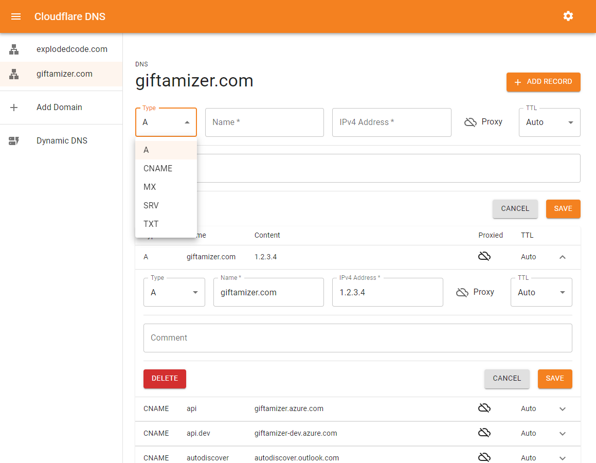
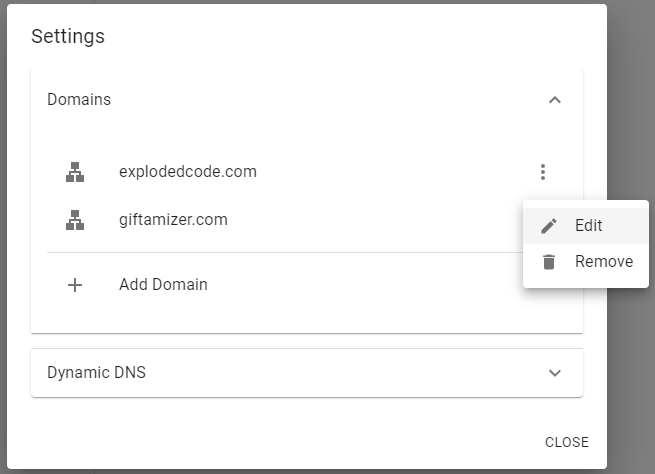

# Cloudflare DNS

Uses [Cloudflare](https://developers.cloudflare.com/api) API to manage DNS records.

<!--  -->


# Features

## Import & Manage Domain Zones


<br/>


## Manage DNS Records


## Dynamic DNS

Trigger DDNS on Public IP change or on a schedule.


# Supported Record Types:

-   A
-   AAAA
-   CNAME
-   MX
-   SRV
-   TXT

# Deploy

```bash
docker run -d \
    -p 8080:8080 \
    --name=cloudflare-dns \
    -e PUBLIC_IP_POLL_RATE_SEC=90 \
    evantrow/cloudflare-dns:latest
```

### Environment Variables

| Variable                | What it do?                                                                                                 |
| ----------------------- | ----------------------------------------------------------------------------------------------------------- |
| PUBLIC_IP_POLL_RATE_SEC | Rate in seconds to poll public ip for dynamic DNS - [ip-monitor](https://github.com/J-Chaniotis/ip-monitor) |

## Security

API tokens are stored in a SQLite file in `/db/database.sqlite`. Ensure proper file permissions are set.
